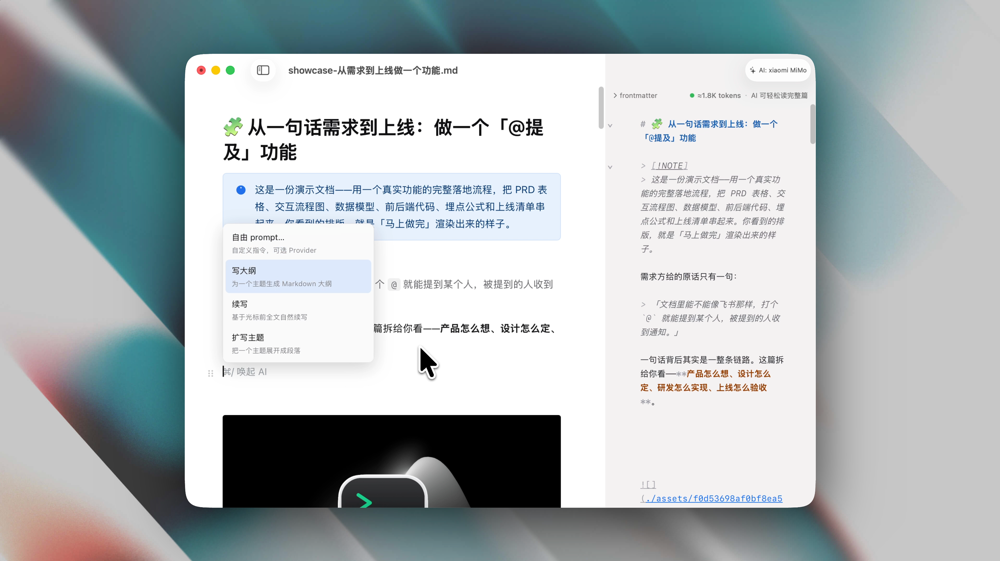
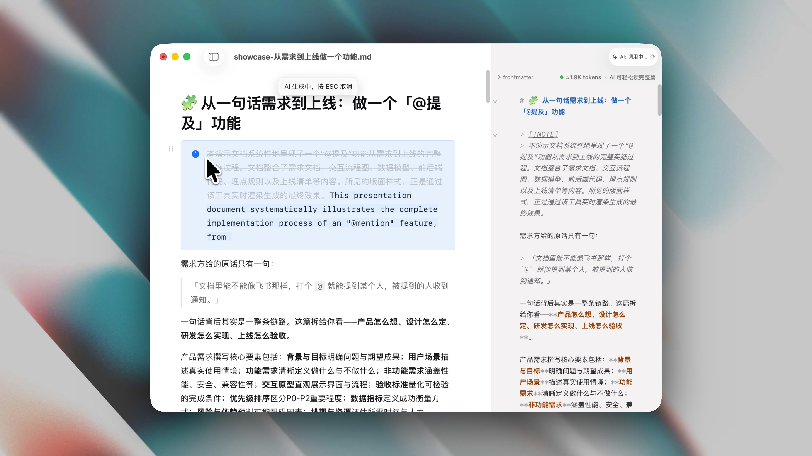
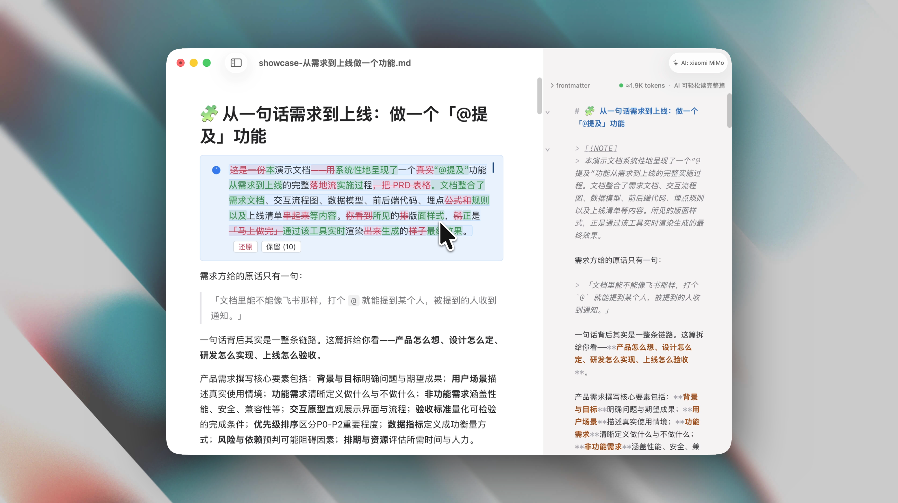
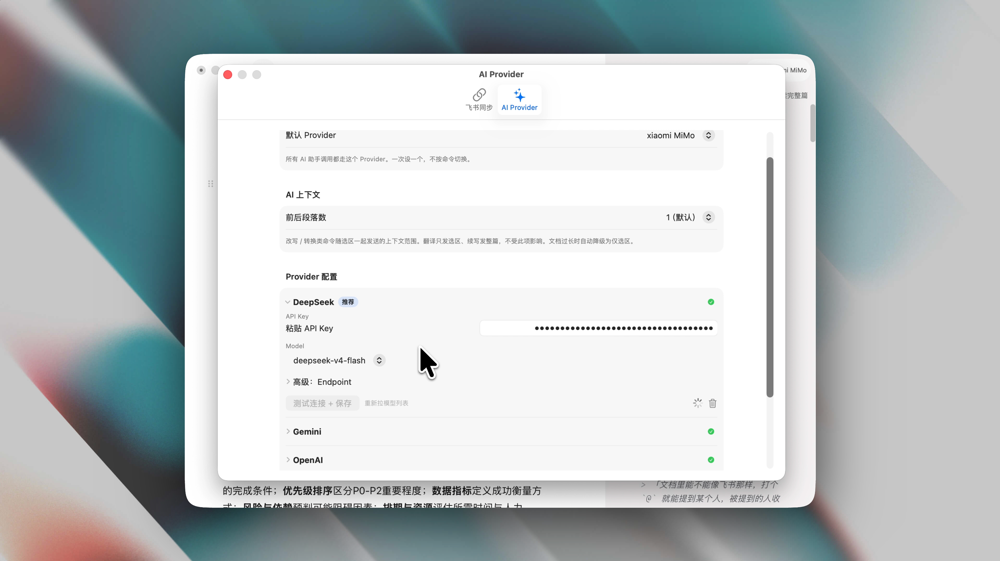
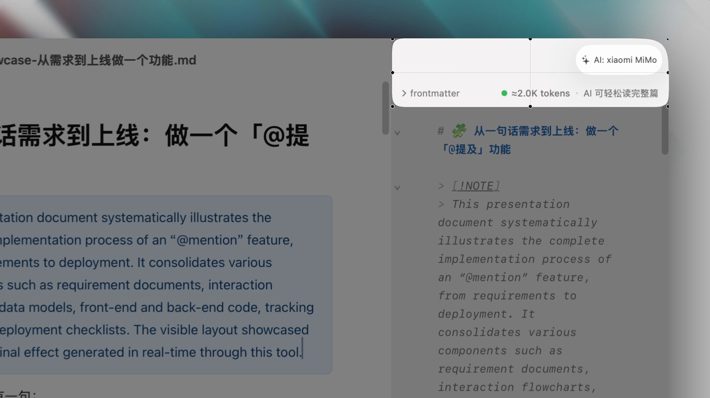

# 马上做完（Done.md）

> 一个 macOS 原生的 Markdown 阅读 / 编辑器 + 飞书桥（a native macOS Markdown reader/editor with a Feishu bridge）。

  

**马上做完**（英文 wordmark：**Done.md**）是给 Mac 用的 Markdown 编辑器。文件永远是一份干净的纯文本 `.md`，在应用里打开却是所见即所得的成品——你不用在「干净」和「好看」之间二选一。

## 它能干嘛（Features）

- **双栏实时镜像**：左边所见即所得地写（Visual 视图），右边实时显示对应的 Markdown 源码——左边改一处，右边立刻跟着变。（当前编辑在左侧富文本进行，右侧源码为实时镜像。）
- **文档大纲边栏**：长文档按标题层级导航，点一下标题两栏一起滚到位。
- **飞书桥（Feishu bridge）**：本地 `.md` 与飞书文档双向同步——标题 / 列表 / 表格 / 高亮块 / Mermaid 走标准 Markdown，飞书独有的块（电子表格 / 画板 / 多维表格等）以占位块保留，来回同步不丢内容。（部分格式与排版细节两侧可能略有差异，但不影响内容同步。）
- **AI 助手（AI assistant）**：选中文字浮窗、或 `⌘/` 唤起，做润色 / 翻译 / 续写 / 生成等轻量转换。支持多个 Provider（DeepSeek / Gemini / OpenAI / Claude / MiMo）。
- **精致渲染（Rich rendering）**：代码块语法高亮 + 一键复制、KaTeX 数学公式、Mermaid 图实时渲染、表格 / 图片样式打磨、图片全屏预览。
- **写作背景主题（Themes）**：跟随系统 / 纸质 / 赛博夜色三套整窗主题，纯显示层、绝不写进磁盘文件。

## 功能演示（In action）

### 🧱 框架：左编辑，右实时同步，大纲一点两栏同跳

左侧所见即所得地编辑，右侧 Markdown 源码实时长出来；打开左侧大纲栏点标题，Visual 与源码两栏同时滚到位。下面这段完整演示了左侧编辑、右侧源码即时更新、以及大纲导航：

https://github.com/user-attachments/assets/ab6b3d57-90a9-4094-a8a7-8bd0bb84bf1e

<table>
  <tr>
    <td></td>
    <td></td>
  </tr>
  <tr>
    <td align="center">大纲收起 · 双栏</td>
    <td align="center">大纲展开 · 三栏</td>
  </tr>
</table>

### 🎨 渲染质量：代码 / 公式 / 图表 / 表格都好看

highlight.js 代码高亮 + 一键复制、KaTeX 数学公式、Mermaid 图表、圆角表格、图片点开系统全屏预览。下面这段完整走了一遍各类格式的渲染效果：

https://github.com/user-attachments/assets/4bed19d9-a95e-4bfc-af86-090f86c279a9

<table>
  <tr>
    <td></td>
    <td></td>
  </tr>
  <tr>
    <td></td>
    <td></td>
  </tr>
</table>

### 🎨 写作背景主题：跟随系统 / 纸质 / 赛博夜色

三套整窗主题——背景、强调色、callout、代码块、Mermaid 全套按主题染色。纯显示层，绝不写进磁盘文件，导出与飞书同步都不受影响。

https://github.com/user-attachments/assets/43c13ba2-a022-45c3-b4d4-2af0d8140909

<table>
  <tr>
    <td></td>
    <td></td>
  </tr>
  <tr><td colspan="2" align="center">🖥️ 跟随系统（深 / 浅）</td></tr>
  <tr>
    <td></td>
    <td></td>
  </tr>
  <tr><td colspan="2" align="center">📜 纸质</td></tr>
  <tr>
    <td></td>
    <td></td>
  </tr>
  <tr><td colspan="2" align="center">🌃 赛博夜色</td></tr>
</table>

### 🤖 AI 助手：选中即用

选中文字弹浮窗，或按 `⌘/` 唤起：润色 / 翻译 / 续写 / 生成，流式替换 + 内联 diff 一键接受或撤销。支持多个 Provider（DeepSeek / Gemini / OpenAI / Claude / MiMo），当前模型在右上角标出。

https://github.com/user-attachments/assets/7b64b55d-175b-48ba-a5ab-36ddf32289c5

<table>
  <tr>
    <td></td>
    <td></td>
    <td></td>
  </tr>
  <tr>
    <td align="center">空行快捷键唤起面板</td>
    <td align="center">AI 实时文字流</td>
    <td align="center">红绿修改 diff 可视化</td>
  </tr>
</table>

<table>
  <tr>
    <td></td>
    <td></td>
  </tr>
  <tr>
    <td align="center">设置里选择模型</td>
    <td align="center">右上角高亮当前模型</td>
  </tr>
</table>

### 🔗 飞书同步：一键推送

`⌘⌥S` 把当前文档同步进飞书，块结构（标题 / 表格 / callout / 图片）保真；`⌘⌥O` 从飞书拉回本地。标准 Markdown 双向无损，飞书独有块以占位保留。

https://github.com/user-attachments/assets/22e79c48-d9c7-476a-9af8-1c6561a1447c

  

## 设计原则（Design principles）

- **单文件编辑器 + 桥**：一份文档 = 一个 `.md` 文件 = 一个窗口。不做笔记库管理、不接管你的文件系统、不建索引。
- **稳定规范化（Stable normalization）**：保存产出确定性的标准格式，之后同一状态永远产出同样字节——git diff 永远干净。
- **不做 RAG**：应用只是阅读 / 编辑器 + 飞书桥。你的 AI / 检索工作流直接读文件系统，应用不当中间人。

## 隐私（Privacy）

**马上做完是一个纯本地 Mac 应用，由我一个人独立开发，没有任何后端服务器。** 你的文档、凭据、AI 请求都不会发给我——我这边也没有任何能收集它们的地方。

- **AI 功能的 API key 只存在你本机**（macOS 钥匙串 / Keychain，加密存储）。它**不会上传到任何服务器、也不经过我手里**——AI 请求从你的 Mac **直连你选择的服务商**（DeepSeek / Gemini / OpenAI / Claude / MiMo），用的是**你自己账号申请的 key**。
- **飞书用的是你自己的账号授权**：通过飞书官方 OAuth 在系统浏览器里登录，同步请求直连飞书官方接口。
- **飞书的 App ID、App Secret 和登录凭据同样只存你本机 Keychain**，不上传、不经手。
- **文件永远只在你的磁盘上**：一份文档就是一个本地 `.md` 文件，应用不建云端副本、不建索引、不做云同步。

## 系统要求（Requirements）

- macOS 13+（Ventura 或更新）

## 安装（Install）

> ⚠️ **当前是未公证的预览版（preview）**——功能完整，但签名 + Apple 公证的正式版还在路上，所以第一次打开需要手动放行一次（下面第 3 步）。

1. 到 [Releases](https://github.com/shampooli61/donemd/releases) 下载最新的预览版 `Done.md-x.y.z.dmg`
2. 双击 `.dmg`，把 `donemd.app` 拖进「应用程序」
3. **第一次打开**（只需一次，之后跟普通应用一样）——三选一：
   - **命令行最省事**：终端运行 `xattr -dr com.apple.quarantine /Applications/donemd.app`，之后双击即开
   - **系统设置**（macOS 15 / 26）：双击 → 弹「无法验证」点「完成」→ 打开「系统设置 → 隐私与安全性」→ 滚到底点「仍要打开」→ 再确认一次
   - **右键打开**（macOS 13 / 14）：在「应用程序」里右键 `donemd.app` →「打开」→ 再点「打开」按钮

> 正式的签名公证版发布后，首次打开就不再需要这一步。

## 从源码构建（Build from source）

见 [`BUILD.md`](BUILD.md)——含前提条件、首次拉取、`project.yml` → xcodegen 流程、命令行 build & test。

## 技术栈（Tech stack）

- **外壳**：SwiftUI macOS App
- **编辑器内核**：WKWebView 内嵌 Tiptap (ProseMirror) + CodeMirror，双向同步
- **渲染**：Mermaid（图）/ KaTeX（公式）/ highlight.js（代码）
- **飞书**：原生 Swift 自建（`donemd/Feishu/`）——走飞书官方 OAuth + 开放接口，块级结构化双向同步

## 命名（Naming）

品牌显示名是「马上做完（Done.md）」；技术标识符统一用 `donemd`（仓库 / 目录 / 命令行），Bundle ID 为 `com.shampoo.donemd`。
